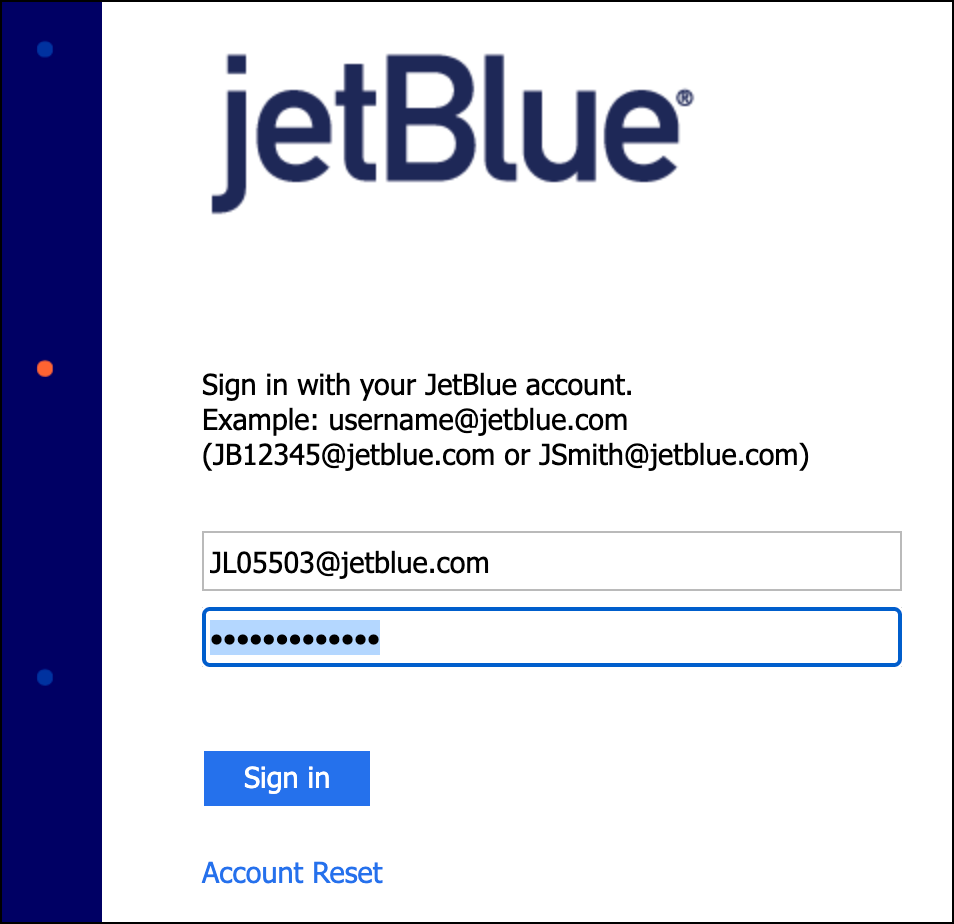
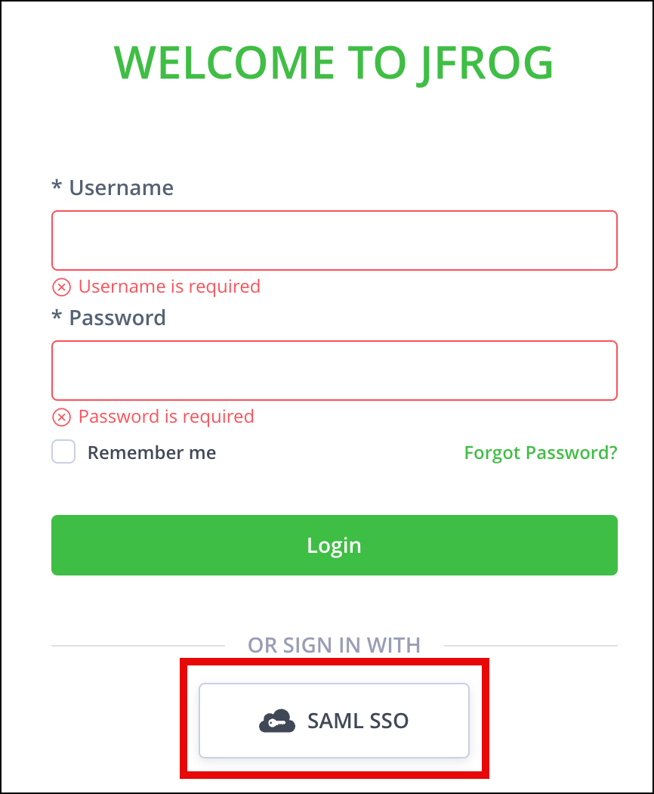
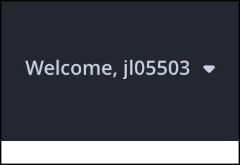

# 💺 ACFP CB Seat Map

[![GitHub][github-badge]][github-url]

[github-badge]: https://img.shields.io/badge/GitHub-cb--seatmap--component-white?logo=github&labelColor=%23181717
[github-url]: https://github.com/jetblueairways/cb-seatmap-component

## 📖 Table of contents

- [🔎 About](#-about)
  - [🔤 Acronyms](#-acronyms)
- [🛠️ Installing](#️-installing)
- [👟 Running](#-running)
- [🧪 Testing changes locally](#-testing-changes-locally)
- [🚀 Publishing](#-publishing)
  - [👀 Example](#-example)
  - [🔧 Troubleshooting `npm ERR! code E401 Incorrect or missing password`](#-troubleshooting-npm-err-code-e401-incorrect-or-missing-password)

## 🔎 About

- An **Angular** / **web component** which allows users to view and select their
  seats for a flight.

- Utilizes the **Crystal Blue** APIs

- For the **jetblue.com** website, this is loaded when the user clicks the
  **Select Seats** button on the `/booking/checkout` page, which opens
  `/booking/cb-seats`.

### 🔤 Acronyms

- **ACFP**: Aircraft Changes Foundational Platform

  - A system designed to enhance customer interactions with flight services,
    including features like seat selection and payment processing.

  - The ACFP integrates various components, such as a seatmap that interacts
    with APIs to provide real-time data and manage user transactions effectively.

  - This platform aims to streamline the booking experience and improve customer
    satisfaction through advanced functionalities and integrations.

  - See: [Confluence - Foundations Team - ACFP Tier 1 Apps: API Project Plan](https://jetblueairways.atlassian.net/wiki/x/zwC0Fw)

  - See: [Confluence - Commercial Technology - Aircraft Changes Foundational Platform](https://jetblueairways.atlassian.net/wiki/x/UIAdB)

- **CB**: Crystal Blue

  - An in-house payment and booking management solution developed by JetBlue's
    [Foundations Team](https://jetblueairways.atlassian.net/wiki/x/AwBZB).

  - It is implemented as a replacement for a third-party payment service called
    [Datalex](https://www.datalex.com/).

  - See: [Confluence - Foundations Team - Crystal Blue](https://jetblueairways.atlassian.net/wiki/x/NARZB)

## 🛠️ Installing

> ⚠️ **Note**: You must use `node` version `16.14` or `18.10+`, as those are the
> only versions compatible with Angular 16.

```sh
npm install --save --exact cb-seat-map

# or
yarn add cb-seat-map --exact
```

## 👟 Running

```sh
npm start
```

## 🧪 Testing changes locally

To test a version of `cb-seat-map` without publishing to Artifactory, you can do
the following:

1. Run `npm run build` to compile the project into `dist/cb-seat-map`

2. In `package.json` of your consuming project, change the version of the
   `cb-seat-map` dependency to point to the filepath where it exists on your
   system using the `file` protocol:

   ```diff
   {
     "dependencies": {
   -   "cb-seat-map": "0.0.14"
   +   "cb-seat-map": "file:../cb-seatmap-component/dist/cb-seat-map"
     }
   }
   ```

3. Save `package.json` and run `yarn` (or `npm install`) to link the package on
   your filesystem

4. When you make more changes to `cb-seat-map`, you will need to:

   a. Run `npm run build` in this project again to update the `dist` folder with
   the new compiled changes

   b. In the consuming project, kill your dev server and start it again to pick
   up the latest changes

## 🚀 Publishing

```sh
# Increments the patch version and executes a dry-run
npm run release:dry-run

# If the dry-run looks good, then publish to Artifactory:
npm run release:prod
```

- This will publish the artifact `cb-seat-map-x.x.x.tgz` to Artifactory at
  https://artifactory.it.jetblue.com/artifactory/nodejs-virtual/cb-seat-map/-/

- Log in with SSO at https://artifactory.it.jetblue.com/ui/repos/tree/General/nodejs-virtual/cb-seat-map/-
  to view the Artifact

### 👀 Example

`npm run release:dry-run`

```sh
$ npm run release:dry-run

> cb-seatmap-component@0.0.0 prerelease:dry-run
> cd projects/cb-seat-map && npm version patch

v0.0.10

> cb-seatmap-component@0.0.0 release:dry-run
> npm run build && cd dist/cb-seat-map && npm publish --dry-run


> cb-seatmap-component@0.0.0 build
> ng build cb-seat-map

Building Angular Package

------------------------------------------------------------------------------
Building entry point 'cb-seat-map'
------------------------------------------------------------------------------
✔ Compiling with Angular sources in Ivy partial compilation mode.
✔ Writing FESM bundles
✔ Copying assets
✔ Writing package manifest
✔ Built cb-seat-map

------------------------------------------------------------------------------
Built Angular Package
 - from: /Users/JL05503/Workspace/cb-seatmap-component-2/projects/cb-seat-map
 - to:   /Users/JL05503/Workspace/cb-seatmap-component-2/dist/cb-seat-map
------------------------------------------------------------------------------

Build at: 2025-07-21T15:40:06.647Z - Time: 2278ms

npm notice
npm notice 📦  cb-seat-map@0.0.10
npm notice === Tarball Contents ===
npm notice 1.9kB   README.md
npm notice 171B    cb-seat-map.d.ts.map
npm notice 500B    esm2022/cb-seat-map.mjs
npm notice 10.3kB  esm2022/lib/cb-seat-map-heads-up-panel/cb-seat-map-heads-up-panel.component.mjs
npm notice 1.9kB   esm2022/lib/cb-seat-map-heads-up-panel/cb-seat-map-heads-up-panel.const.mjs
npm notice 513B    esm2022/lib/cb-seat-map-heads-up-panel/cb-seat-map-heads-up-panel.type.mjs
npm notice 47.8kB  esm2022/lib/cb-seat-map-legend/cb-seat-map-legend.component.mjs
npm notice 95.5kB  esm2022/lib/cb-seat-map-section/cb-seat-map-section.component.mjs
npm notice 31.8kB  esm2022/lib/cb-seat-map-traveler-panel/cb-seat-map-traveler-panel.component.mjs
npm notice 12.0kB  esm2022/lib/cb-seat-map/cb-seat-map.component.mjs
npm notice 9.3kB   esm2022/lib/cb-seat-map/cb-seat-map.types.mjs
npm notice 134.7kB esm2022/lib/cb-seat-selection-cms-content/cb-seat-selection-cms-content.const.mjs
npm notice 6.7kB   esm2022/lib/cb-seat-selection-cms-content/cb-seat-selection-cms-content.service.mjs
npm notice 31.1kB  esm2022/lib/cb-seats/cb-seats.component.mjs
npm notice 8.9kB   esm2022/lib/internal/jb-enums.const.mjs
npm notice 2.8kB   esm2022/lib/internal/log.util.mjs
npm notice 1.2kB   esm2022/public-api.mjs
npm notice 171.3kB fesm2022/cb-seat-map.mjs
npm notice 175.4kB fesm2022/cb-seat-map.mjs.map
npm notice 157B    index.d.ts
npm notice 4.4kB   lib/cb-seat-map-heads-up-panel/cb-seat-map-heads-up-panel.component.d.ts
npm notice 707B    lib/cb-seat-map-heads-up-panel/cb-seat-map-heads-up-panel.component.d.ts.map
npm notice 484B    lib/cb-seat-map-heads-up-panel/cb-seat-map-heads-up-panel.const.d.ts
npm notice 394B    lib/cb-seat-map-heads-up-panel/cb-seat-map-heads-up-panel.const.d.ts.map
npm notice 161B    lib/cb-seat-map-heads-up-panel/cb-seat-map-heads-up-panel.type.d.ts
npm notice 328B    lib/cb-seat-map-heads-up-panel/cb-seat-map-heads-up-panel.type.d.ts.map
npm notice 4.8kB   lib/cb-seat-map-legend/cb-seat-map-legend.component.d.ts
npm notice 1.1kB   lib/cb-seat-map-legend/cb-seat-map-legend.component.d.ts.map
npm notice 6.5kB   lib/cb-seat-map-section/cb-seat-map-section.component.d.ts
npm notice 2.1kB   lib/cb-seat-map-section/cb-seat-map-section.component.d.ts.map
npm notice 5.1kB   lib/cb-seat-map-traveler-panel/cb-seat-map-traveler-panel.component.d.ts
npm notice 872B    lib/cb-seat-map-traveler-panel/cb-seat-map-traveler-panel.component.d.ts.map
npm notice 1.5kB   lib/cb-seat-map/cb-seat-map.component.d.ts
npm notice 751B    lib/cb-seat-map/cb-seat-map.component.d.ts.map
npm notice 6.3kB   lib/cb-seat-map/cb-seat-map.types.d.ts
npm notice 6.4kB   lib/cb-seat-map/cb-seat-map.types.d.ts.map
npm notice 46.9kB  lib/cb-seat-selection-cms-content/cb-seat-selection-cms-content.const.d.ts
npm notice 963B    lib/cb-seat-selection-cms-content/cb-seat-selection-cms-content.const.d.ts.map
npm notice 867B    lib/cb-seat-selection-cms-content/cb-seat-selection-cms-content.service.d.ts
npm notice 535B    lib/cb-seat-selection-cms-content/cb-seat-selection-cms-content.service.d.ts.map
npm notice 2.0kB   lib/cb-seats/cb-seats.component.d.ts
npm notice 1.1kB   lib/cb-seats/cb-seats.component.d.ts.map
npm notice 3.3kB   lib/internal/jb-enums.const.d.ts
npm notice 866B    lib/internal/jb-enums.const.d.ts.map
npm notice 584B    lib/internal/log.util.d.ts
npm notice 304B    lib/internal/log.util.d.ts.map
npm notice 1.0kB   package.json
npm notice 361B    public-api.d.ts
npm notice 251B    public-api.d.ts.map
npm notice === Tarball Details ===
npm notice name:          cb-seat-map
npm notice version:       0.0.10
npm notice filename:      cb-seat-map-0.0.10.tgz
npm notice package size:  174.5 kB
npm notice unpacked size: 844.8 kB
npm notice shasum:        507eb4606b2403af04495c3d4e09926b292f284d
npm notice integrity:     sha512-P26rWQcjrmMPY[...]3pEzOnvVcxFQw==
npm notice total files:   49
npm notice
npm notice Publishing to https://artifactory.it.jetblue.com/artifactory/api/npm/nodejs-virtual/ with tag latest and default access (dry-run)
+ cb-seat-map@0.0.10
```

`npm run release:prod`

```sh
$ npm run release:prod

> cb-seatmap-component@0.0.0 release:prod
> cd dist/cb-seat-map && npm publish

npm notice
npm notice 📦  cb-seat-map@0.0.10
npm notice === Tarball Contents ===
npm notice 1.9kB   README.md
npm notice 171B    cb-seat-map.d.ts.map
npm notice 500B    esm2022/cb-seat-map.mjs
npm notice 10.3kB  esm2022/lib/cb-seat-map-heads-up-panel/cb-seat-map-heads-up-panel.component.mjs
npm notice 1.9kB   esm2022/lib/cb-seat-map-heads-up-panel/cb-seat-map-heads-up-panel.const.mjs
npm notice 513B    esm2022/lib/cb-seat-map-heads-up-panel/cb-seat-map-heads-up-panel.type.mjs
npm notice 47.8kB  esm2022/lib/cb-seat-map-legend/cb-seat-map-legend.component.mjs
npm notice 95.5kB  esm2022/lib/cb-seat-map-section/cb-seat-map-section.component.mjs
npm notice 31.8kB  esm2022/lib/cb-seat-map-traveler-panel/cb-seat-map-traveler-panel.component.mjs
npm notice 12.0kB  esm2022/lib/cb-seat-map/cb-seat-map.component.mjs
npm notice 9.3kB   esm2022/lib/cb-seat-map/cb-seat-map.types.mjs
npm notice 134.7kB esm2022/lib/cb-seat-selection-cms-content/cb-seat-selection-cms-content.const.mjs
npm notice 6.7kB   esm2022/lib/cb-seat-selection-cms-content/cb-seat-selection-cms-content.service.mjs
npm notice 31.1kB  esm2022/lib/cb-seats/cb-seats.component.mjs
npm notice 8.9kB   esm2022/lib/internal/jb-enums.const.mjs
npm notice 2.8kB   esm2022/lib/internal/log.util.mjs
npm notice 1.2kB   esm2022/public-api.mjs
npm notice 171.3kB fesm2022/cb-seat-map.mjs
npm notice 175.4kB fesm2022/cb-seat-map.mjs.map
npm notice 157B    index.d.ts
npm notice 4.4kB   lib/cb-seat-map-heads-up-panel/cb-seat-map-heads-up-panel.component.d.ts
npm notice 707B    lib/cb-seat-map-heads-up-panel/cb-seat-map-heads-up-panel.component.d.ts.map
npm notice 484B    lib/cb-seat-map-heads-up-panel/cb-seat-map-heads-up-panel.const.d.ts
npm notice 394B    lib/cb-seat-map-heads-up-panel/cb-seat-map-heads-up-panel.const.d.ts.map
npm notice 161B    lib/cb-seat-map-heads-up-panel/cb-seat-map-heads-up-panel.type.d.ts
npm notice 328B    lib/cb-seat-map-heads-up-panel/cb-seat-map-heads-up-panel.type.d.ts.map
npm notice 4.8kB   lib/cb-seat-map-legend/cb-seat-map-legend.component.d.ts
npm notice 1.1kB   lib/cb-seat-map-legend/cb-seat-map-legend.component.d.ts.map
npm notice 6.5kB   lib/cb-seat-map-section/cb-seat-map-section.component.d.ts
npm notice 2.1kB   lib/cb-seat-map-section/cb-seat-map-section.component.d.ts.map
npm notice 5.1kB   lib/cb-seat-map-traveler-panel/cb-seat-map-traveler-panel.component.d.ts
npm notice 872B    lib/cb-seat-map-traveler-panel/cb-seat-map-traveler-panel.component.d.ts.map
npm notice 1.5kB   lib/cb-seat-map/cb-seat-map.component.d.ts
npm notice 751B    lib/cb-seat-map/cb-seat-map.component.d.ts.map
npm notice 6.3kB   lib/cb-seat-map/cb-seat-map.types.d.ts
npm notice 6.4kB   lib/cb-seat-map/cb-seat-map.types.d.ts.map
npm notice 46.9kB  lib/cb-seat-selection-cms-content/cb-seat-selection-cms-content.const.d.ts
npm notice 963B    lib/cb-seat-selection-cms-content/cb-seat-selection-cms-content.const.d.ts.map
npm notice 867B    lib/cb-seat-selection-cms-content/cb-seat-selection-cms-content.service.d.ts
npm notice 535B    lib/cb-seat-selection-cms-content/cb-seat-selection-cms-content.service.d.ts.map
npm notice 2.0kB   lib/cb-seats/cb-seats.component.d.ts
npm notice 1.1kB   lib/cb-seats/cb-seats.component.d.ts.map
npm notice 3.3kB   lib/internal/jb-enums.const.d.ts
npm notice 866B    lib/internal/jb-enums.const.d.ts.map
npm notice 584B    lib/internal/log.util.d.ts
npm notice 304B    lib/internal/log.util.d.ts.map
npm notice 1.0kB   package.json
npm notice 361B    public-api.d.ts
npm notice 251B    public-api.d.ts.map
npm notice === Tarball Details ===
npm notice name:          cb-seat-map
npm notice version:       0.0.10
npm notice filename:      cb-seat-map-0.0.10.tgz
npm notice package size:  174.5 kB
npm notice unpacked size: 844.8 kB
npm notice shasum:        507eb4606b2403af04495c3d4e09926b292f284d
npm notice integrity:     sha512-P26rWQcjrmMPY[...]3pEzOnvVcxFQw==
npm notice total files:   49
npm notice
npm notice Publishing to https://artifactory.it.jetblue.com/artifactory/api/npm/nodejs-virtual/ with tag latest and default access
+ cb-seat-map@0.0.10
```

### 🔧 Troubleshooting `npm ERR! code E401 Incorrect or missing password`

When running `npm run release:prod`, if you receive a message like the
following:

```sh
npm notice Publishing to https://artifactory.it.jetblue.com/artifactory/api/npm/nodejs-virtual/ with tag latest and default access
npm ERR! code E401
npm ERR! Incorrect or missing password.
npm ERR! If you were trying to login, change your password, create an
npm ERR! authentication token or enable two-factor authentication then
npm ERR! that means you likely typed your password in incorrectly.
npm ERR! Please try again, or recover your password at:
npm ERR!     https://www.npmjs.com/forgot
npm ERR!
npm ERR! If you were doing some other operation then your saved credentials are
npm ERR! probably out of date. To correct this please try logging in again with:
npm ERR!     npm login

npm ERR! A complete log of this run can be found in:
npm ERR!     /Users/JL05503/.npm/_logs/2025-07-31T15_31_43_809Z-debug-0.log
```

then you will need to log in to Artifactory. To do this:

1. Run the following:

   ```sh
   npm login
   ```

   It should display something like the following:

   ```sh
   npm notice Log in on https://artifactory.it.jetblue.com/artifactory/api/npm/nodejs-virtual/
   Login at:
   https://artifactory.it.jetblue.com:443/ui/auth-provider/npm?     uuid=JEGQx3912um5A7NdePwspCFpiaXfMmr8oCzx37UgvMyQfAVgfrNPKai539WDFU92rrdyE4V2nG2xp35E5uZ7Ukdj2zTNX7xCeejrKT377GD7Vs18UU1
   Press ENTER to open in the browser...
   ```

2. Press `ENTER` to open the sign-in page in the browser, sign in with your
   JetBlue SSO:

   

3. You'll be redirected to the JFrog Artifactory sign-in page, click **Sign in
   with SAML SSO**:

   

   It should automatically authenticate you and you should be signed in:

   

4. The `npm login` script generally gets stuck at this step and does not
   automatically finish the login process in the terminal. Press `Ctrl + C` to
   cancel the script

5. Run this again:

   ```sh
   npm login
   ```

   And press `Enter`. You should see this interstitial message in your browser:

   

   And the `npm login` script should complete and display a message like the
   following:

   ```sh
   npm notice Log in on https://artifactory.it.jetblue.com/artifactory/api/npm/nodejs-virtual/
   Login at:
   https://artifactory.it.jetblue.com:443/ui/auth-provider/npm?   uuid=JEG8fXbX6ar8BBUQbwX5A5D4dtQVaXz858xKbE7DUTGDr8zxqtnwjSkav7LSdfMedVGaWk4NHBfArbwmRNFFKW8TyYxuCTGcAU3ozT14gM3twxuyfiB
   Press ENTER to open in the browser...

   Logged in on https://artifactory.it.jetblue.com/artifactory/api/npm/nodejs-virtual/.
   ```

6. Run `npm run release:prod` again, and it should publish successfully:

   ```sh
   npm notice === Tarball Details ===
   npm notice name:          cb-seat-map
   npm notice version:       0.0.15
   npm notice filename:      cb-seat-map-0.0.15.tgz
   npm notice package size:  198.7 kB
   npm notice unpacked size: 957.7 kB
   npm notice shasum:        bda4fec470ffbea58d250d226a0eb25671cf0455
   npm notice integrity:     sha512-X7sOc5CZ7GIeY[...]Usu4ZSySxEy1A==
   npm notice total files:   55
   npm notice
   npm notice Publishing to https://artifactory.it.jetblue.com/artifactory/api/npm/nodejs-virtual/
   with tag latest and default access
   + cb-seat-map@0.0.15
   ```
